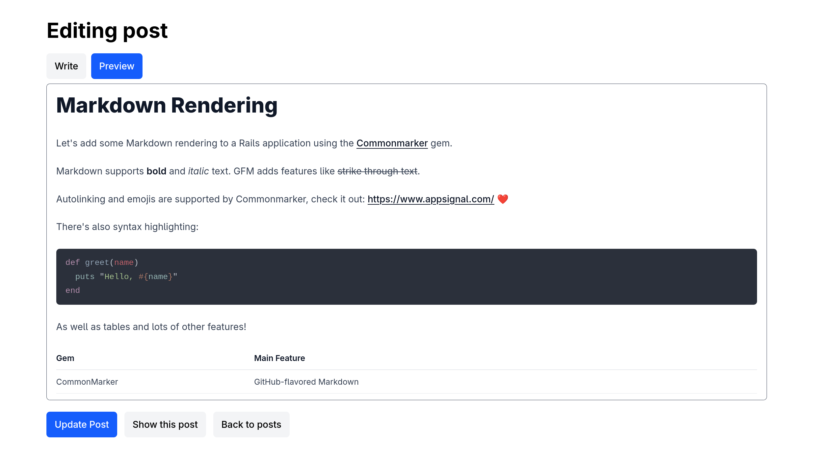

# GitHub Markdown Editor from Scratch

This repository contains a demo Rails application that implements a basic GitHub-like markdown editor as seen on the [Appsignal Blog](https://blog.appsignal.com/).

